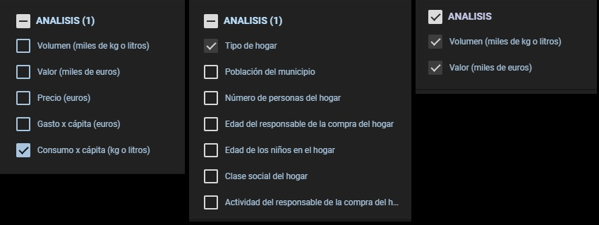
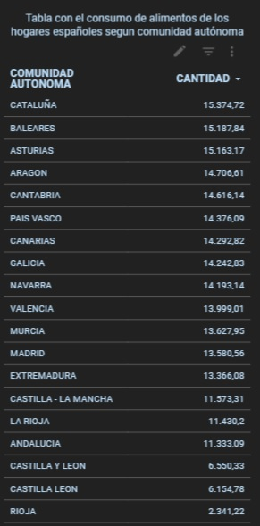
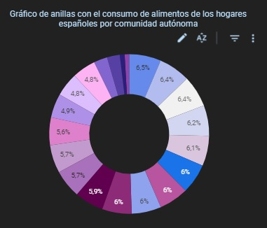
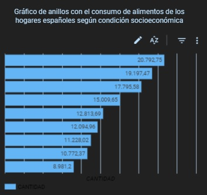
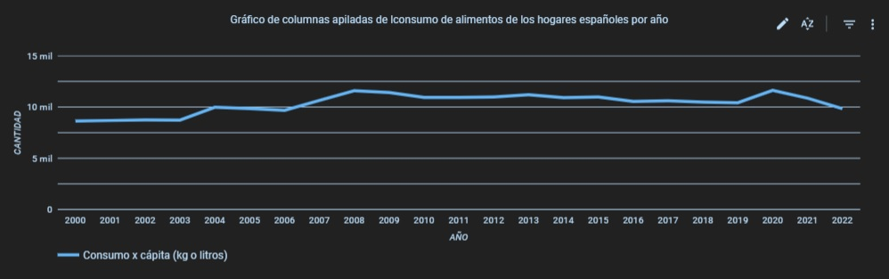

# **CONSUMO DE ALIMENTO DE LOS HOGARES ESPAÑOLES**

## **Introducción**

Un proyecto de análisis de datos tiene como objetivo final obtener información valiosa de un conjunto de datos que nos permita tomar decisiones informadas. Para garantizar la eficacia y eficiencia del proyecto, éste debe contar con una metodología, es decir, debe desarrollarse sigueindo un conjunto de pasos estructurados y planificados de manera sistemático. 

A través del análisis del consumo de alimentos en los hogares españoles, quiero mostrar mi capacidad para trabajar con datos y extraer información relevante. No se trata sólo de entender qué comen las familias en España, sino de mostrar cómo pudo abordar un proyecto de análisis de datos de principio a fin. Desde la recopilación y liempieza de los datos hasta la creación de visualizaciones. 

Sin más preámbulos, te invito a explorar este análisis de datos y ver cómo las familias españolas eligen y consumen sus alimentos. 

## **1. Objetivos del Proyecto**

El propósito fundamental de este proyecto es demostrar mi hailidad para tabajar con datos y extraer información relevante de ellos. Para logarlo, he seleccionado como ejemplo un análisis de datos enfocado en el consumo de alimentos en los hogares españoles.

Los obetivos específicos de este proyecto son los siguientes:

1. **Análisis Descriptivo**: Realizar un análisis detallado y descriptivo del comportamiento alimenticio de los hogares españoles. Este enfoque proporcionará una comprensión profunda de las tendencias y patrones en el consumo de alimentos.

2. **Visualización de Datos**: Utilizar herramientas de visualización de datos para presentar los resultados de manera efectiva y  accesible. Las visualizaciones ayudarán a comuicar los hallazgos de manera clara y comprensible.

3. **Formulación de Preguntas Claves para Futuros Proyectos**: Aunque este proyecto se centra en el análisis descriptivo, también se plantearán preguntas, que, a mi modo de ver, son interesantes no sólo para conocer mejor el comportamiento alimenticio de los hogares españoles, sino también para desarrollar futuros proyectos de análisis de datos de otros tipos.

En resumen, este proyecto busca destacar mi capacidad para abordar un análisis de datos desde la recopilación y limpieza inicial hasta la presentación de resultados significativos. Además, sienta las bases para investigaciones posteriores, demostrando un enfoque continuo en el análisis de datos como herramienta para la toma de decisiones fundamentales.

## 2. **Fuente de datos**

Los datos utilizados en este proyecto se obtienen de la serie histórica de datos de consumo alimentario en hogares españoles a nivel agregado anual, proporcionada por el [Ministerior de Agricultura, Pesca y Alimentación (MAPA)](https://www.mapa.gob.es/es/alimentacion/temas/consumo-tendencias/panel-de-consumo-alimentario/series-anuales/).

Estos conjuntos de datos, se encuentran alojados en la carpeta "datos_origen" de este repositorio. El conjunto de datos consta de 22 documentos en formato .XLSX. Cada documento almacena los datos para un año, desde el 2000 hasta el 2022. Además, cada archivo tiene 14 hojas que son:
- Portada
- VALOR: contiene el valor en euros de los alimentos que han tenido que pagar los hogares españoles
- VOLUMEN: contiene el volumen, es decir, la candidad de alimentos consumidos por los hogares españoles, medidos en kilos o litros
- PENETRACIÓN: representa la proporción de la población que ha consumido un alimento específico
- PRECIO: representa el precio de cada alimento. Se calcula dividiendo el valor entre el volumen.
- CONSUMOXCÁPITA: refiere al promedio de consumo de un alimento específico por cada individuo durante un período de tiempo determinado. Se calcula dividiendo el volumen de un alimento entre la población total
- GASTOXCÁPITA: se refiere al promedio de gasto total realizado en un determinado alimento por cada individuo durante un período de tiempo específico. La fórmula para calcular el gasto per cápita es la siguiente: Gasto per cápita = Gasto total en un bien o servicio / Población total
- CANALES VALOR: diferentes vías o canales a través de los cuales los alimentos llegan a los consumidores finales y cómo contribuyen al valor económico en la cadena de suministro de alimentos
- CANALES VOLUMEN: representa en como contribuyen en terminos de volumen a la distribución de alimentos cada canal de comercialización
- CANALES PENETRACIÓN: Representa la proporción en la que los diferentes canales distribuyen un alimento determinado.
- SOCIOECONÓMICO VALOR: representa el valor en euros de los alimentos que consumen los hogares españoles dependiendo de ciertas condiciones socioeconómicas de los mismo.
- SOCIOECONÓMIVO VOLUMEN: representa el valomen de alimentos que consumen los hogares españoles dependiendo de ciertas condiciones socioeconómicas de los mismo. 
- SOCIOECONÓMICO CONSUMOXCAPITA: refiere al promedio de consumo de un alimento específico por cada individuo durante un período de tiempo determinado, teniendo encuenta ciertas condiciones socieconómica. 

Las hojas VALOR, VOLUMEN, PENETRACIÓN, PRECIO, CONSUMOXCÁPITA y GASTOXCÁPITA incluyen 18 variables, que se refiere, en primer lugar a los alimentos, en segundo lugar a los datos del total de España, luego 17 columnas una para cada comunidad autónoma. Los archivos de los años 2004 al 2019, además de estas variables incluyen 8 columnas más que se refieren a regiones de España.

Las hojas CANALES VALOR, CANALES VOLUMEN y CANALES PENETRACIÓN incluye 22 variables, a parte, claro esta, la de los alimentos y la de total España. Estas variables son: TDA.TRADICIONAL, ECONOMATO/COOP, HERPERCADOS, SUPER/AUTOS/G.ALM, SUPER+AUTOS, DISCOUNTS, TDA.CONGELADOS, HERBORISTERIA, FARMACIA, VTA.DOMICILIO, PESCADERIA, CARNICERIA/CHARC. MERCADOS, RESTO  e INTERNET. Estas variables no son comunes a todas los archivos ya que existieron moficaciones en la contabilidad. 

Por último, las hojas SOCIOECONÓMICO VALOR, SOCIOECONÓMIVO VOLUMEN y SOCIOECONÓMICO CONSUMOXCAPITA incluye 8 situaciones ocioeconómicas, que son:
- CLASE SOCIAL: ALTA Y MEDIA ALTA, MEDIA, MEDIA BAJA y BAJA
- NIÑOS EN EL HOGAR: SIN NIÑOS, NIÑOS-6AÑOS y NIÑOS 6 A 15 AÑOS
- ACTIVIDAD RESPONSABLE DE COMPRA: ACTIVA y NO ACTIVA
- EDAD RESPONSABLE DE COMPRA: -35 AÑOS, 35 A 49 AÑOS, 50 A 64 AÑOS y 65 Y MAS AÑOS.
- TAMAÑO DE HOGAR: 1 PERSONA, 2 PERSONAS, 3 PERSONAS, 4 PERSONAS, 5 Y MAS PERSONAS
- REGIÓN: NORESTE, LEVANTE, ANDALUCIA, CENTRO-SUR, CASTILLA Y LEON, NOROESTE, NORTE y T.CANARIAS
- TAMAÑÓ DE HÁBITAR: <2000 HABIT., 2000 A 10000, 10001 A 100000, 100001 A 500000, + DE 500000.
- TIPO DE HOGAR: JOVENES INDEPENDIENTES, PAREJ.JOVENES SIN HIJOS, PARJ.CON HIJOS PEQUEÑOS, PAREJ.CON HIJOS EDAD EMEDIA, PAREJ CON HIJOS MAYORES, HOGARES MONOPARENTALES, PAREJAS ADULTAS SIN HIJOS, ADULTOS INDEPENDIENTES y RETIRADOS.

La desagregación en tres categorías, territorial, sociodemográfica y por canal de compra, es esencial, ya que influye tanto en la preparación de los datos como en la creación de visualizaciones. Este enfoque nos permitá explorar y analizar patrones y tendencias desde diversas perspectivas, enriqueciendo así la comprensión de los datos.

## 3. **Herramientas**

Para la preparación de los datos he utilizado el lenguaje de programación Python, en el entorno de desarrollo integrado PyCharm. 

Las librerías que he empleado han sido:

  - **Pandas**: que es una biblioteca que utilizo para la manipulación y análisis de datos.
  - **Request**: me permite enviar solicitudes HTTP a través de la red, es decir, me permite poder acceder a los datos de origen, alojados en el repositorio.
  - **Os**: es una biblioteca estándar de Python, que me proporciona una interface parainteractural con el sistema operativo subyacente, en este caso Windows, y que utilizó para exportar los modelos de datos resultantes.
  - **Openpyxl**: permite leer y escribir archivos XLSX, así como manipular hojas de cálculo y celdas en esos archivos.

Los script con el código fuente resultantes, pueden consultarse en la carpeta "codigo" del repositorio.

Los archivos .csv se pueden consultar en la carpeta "datos_preprocesados" del repositorio.

Para la creación de las visualizaciones, he creado un cuadro de mandos, que he alojado en Google Looker Studio, que es una plataforma de análisis y visualización de datos que permite no sólo explorar y analizarlos, sino además compartir la información. Esta plataforma se enfoca en la creación de paneles de visualizaciones interactivas. Puede consultar el cuadro de mandos en el siguiente enlace: [Consumo de alimentos de los hogares españoles](https://lookerstudio.google.com/reporting/2bb1555c-8d3d-4611-99c2-22dc4da3b0d7/page/p_tw2zngzu8c)

## 4. **Preparación de los datos**

Los datos que voy a utilizar en el proyecto estan en 22 archivos en formato .XLSX. Cada archivo corresponde a un año, desdel el 2000 al 2022. En cada archivo existen diferentes hojas, que están colocadas de forma diferente. 

Los datos, que voy a utilizar, los he clasificado en tres categorias: territorios, socioeconómicos y canales de venta. 

En la clase territorio preprara los datos referente al consumo de alimento de las familias españolas por Comunidades Autónomas. En esta categoria corresponde las hojas VALOR, CONSUMO, GASTOXCAPITA Y CONSUMOXCAPITA.

En la clase socioeconómicos guardo los datos referente al consumo de alimentos de los hogares españoles segun ciertas variables socioeconómicas, como son: el tamaño de hogar, clase social, niños en el hogar, etc. En estacategoría corresponde las hojas  SOCIOECONOMICO VALOR, SOCIOECONOMICO VOLUMENT y SOCIOECONOMICO CONSUMOXCAPITA.

Por útlimo, en la clase canales de venta almaceno los datos referente al canal de venta de los alimentos consumidos por los hogares españoles. En esta categoria corresponde a las hojas CANALES VOLUMEN y CANALES VALOR.

Como se ha indicado anteriormente, en la carpeta "codigo" de este repositorio puedes encontrar los script que he elaborada para la preparación de los datos de cada categoria y donde podrá encontrar comentados los pasos que he ido realizando, que son:

- Instalación e importación de las librerías que he utilizado.

- Importación de los datos y su transformación en DataFrame.

- Analisis Exploratorio de los Datos (EDA) que me permite entender y localizar errores en los datos.

- Tansformación de los datos.

- Modelado de los datos.

- Exportación del modelo de datos resultante a un archivo .csv que se cargarán posteriormente como fuente de datos en Google Looker.

## 5. **Visualizaciones**

Para la elaboración de las visualizaciones he creado un cuadro de mandos con Google Looker. Este informe esta compuesto de tres hojas, una paraca categoria de datos, es decir, la primera hoja para el analisis territorial, la segunda para el análisis socioeconómico y la tercera para el análisis según el canal de venta. 

En este cuadro de mando, además, he utilizado las siguientes tipos de visualizaciones o gráficas:

- **Cuadros de control con lista de tamaño fijo** permiten filtrar y seleccionar datos específicos de una lista predefinida. 

- **Las tablas** muestran datos de una manera tabular y estructurada 

- **Las gráficas de anillos** representa datos circulares o proporcionales de una manera fácilmente comprensible.

- ** Los gráfico de barras** son una de las visualizaciones de datos más comunes y versátiles. Se utilizan para representar datos en forma de barra rectanguales que muestran la cantidad o frecuencia de una categoría o variable determinada. 

- **El gráfico de línes** se utilizan para representar la tendencia o cambio en los datos a lo largo del tiempo.

## 6. **Conclusiones**

Despues de realizar el análisis de los datos, he podido extraer las siguientes conclusiones con respecto al comportamiento del consumo de alimentos de los hogares españoles en el periodo de tiempo que va desde el 2000 hasta el 2022:

- 
 
